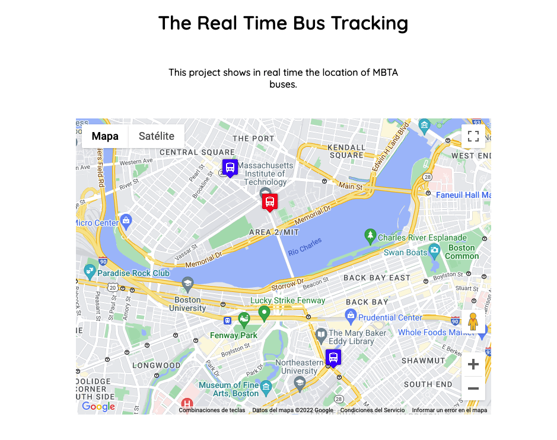

 
  

&#xa0;

<h1 align="center">Real-Time-Bus-Tracking</h1>

  <a href="#dart-Description">Description</a> &#xa0; | &#xa0; 
  <a href="#rocket-How-to-run">How to run</a> &#xa0; | &#xa0;
  <a href="#white_check_mark-Roadmap-of-future-improvements">Roadmap of future improvements</a> &#xa0; | &#xa0;
  <a href="#memo-license">License</a> &#xa0; | &#xa0;
  <a href="https://github.com/arturomsoberanes" target="_blank">Author</a>

 

## :dart: Description

Animation of route in real time

## :rocket: How-to-run

Copy the repo to your PC and open the index.html

## :white_check_mark: Roadmap-of-future-improvements

You don't need anything extra to play

## :memo: License

This project is under license from MIT. For more details, see the [LICENSE](LICENSE) file.

Made with :heart: by <a href="https://github.com/arturomsoberanes" target="_blank">arturomsoberanes</a>

&#xa0;

<a href="#top">Back to top</a>
